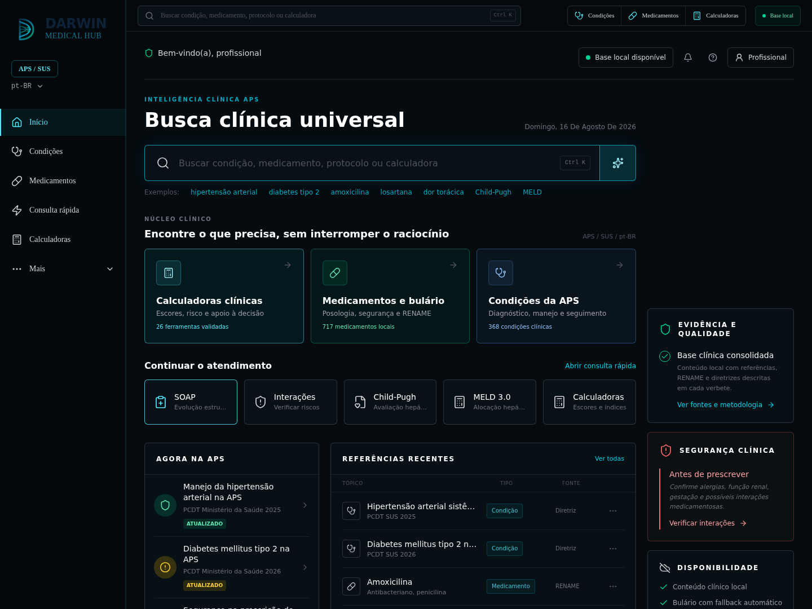
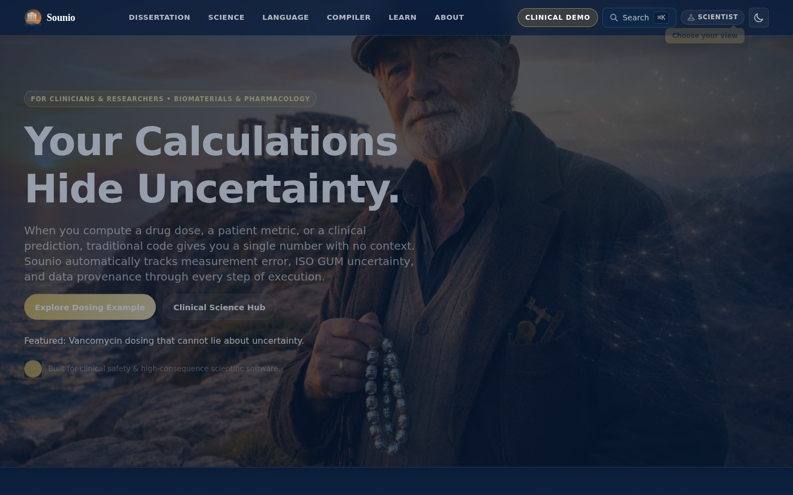

  

  

  <a href="https://mfc.agourakis.med.br">Darwin-MFC</a>
  ·
  <a href="https://www.souniolang.org">Sounio</a>
  ·
  <a href="https://orcid.org/0009-0001-8671-8878">ORCID</a>
  ·
  <a href="https://huggingface.co/chiuratto-AIgourakis">Hugging Face</a>

MD candidate at São Leopoldo Mandic. M.Sc. student in Biomaterials & Regenerative Medicine at PUC-SP.

---

### Darwin-MFC

Clinical hub for family and community medicine (APS / SUS). Search, calculators, drugs, conditions.

[mfc.agourakis.med.br](https://mfc.agourakis.med.br)

### Sounio

Systems + scientific language. Types carry confidence, units, and effects.

[souniolang.org](https://www.souniolang.org) · [Sounio-lang/sounio](https://github.com/Sounio-lang/sounio)
